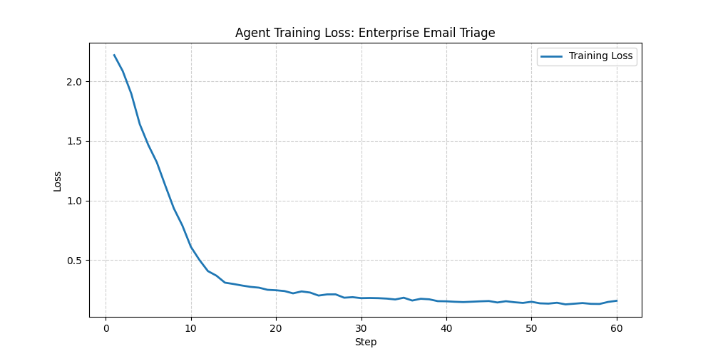
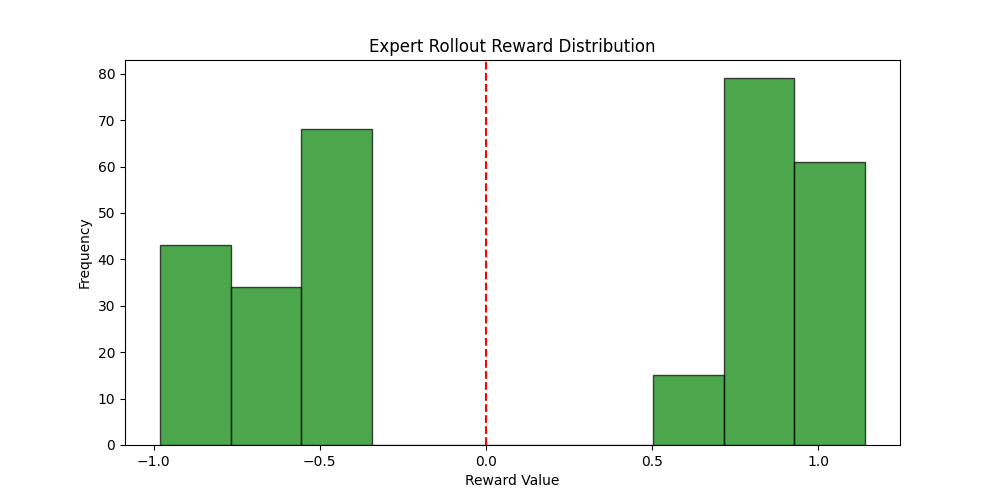

# 📧 Enterprise Email Triage Simulator
### Meta PyTorch OpenEnv AI Hackathon Submission

[](https://huggingface.co/spaces/Proteinrequired/enterprise-email-triage)

This project introduces an autonomous agentic system for corporate email triage, built on the **OpenEnv** framework. It automates high-volume decision-making—routing VIP issues to humans while auto-responding to routine tasks—using a fine-tuned **Llama-3.2-3B** model.

---

## 📽️ Write-up
* **Technical Blog Post:** [Read the full write-up here](./BLOG.md)
* **Training Workbench:** [Click here to view](https://huggingface.co/spaces/Proteinrequired/email-agent-training)

## 💡 Motivation
In large enterprises, communication bottlenecks lead to delayed IT support and missed VIP opportunities. This environment was built to solve the **"Triage Fatigue"** problem by training an agent that understands urgency, sender priority, and corporate context, allowing human employees to focus on complex problem-solving.

---

## 📊 Training Evidence & Results
The agent underwent Behavioral Cloning (BC) using **Unsloth** and **Hugging Face TRL**. We collected expert-weighted rollouts where the agent was rewarded for accuracy and penalized for misrouting.

| **Training Loss (Convergence)** | **Reward Distribution (Performance)** |
| :---: | :---: |
|  |  |

> **Analysis:** The loss curve shows successful optimization of the LoRA adapters over 60 steps. The reward histogram proves the agent successfully shifted its behavior toward high-reward actions.

---

## 🏗️ Environment Logic (OpenEnv)
This project is built on the **latest OpenEnv release**, extending the framework to handle high-dimensional text-based corporate state spaces.

### LLM-Friendly State Space
The environment returns observations as flat dictionaries optimized for LLM prompt injection:

```python
{
    "current_email": {
        "email_id": "email_001",
        "sender": "user@company.com",
        "subject": "Password Reset Request",
        "body": "Email content...",
        "intent": "routine_password_reset",
        "priority": 2,
        "is_vip": False,
        "suggested_department": "IT"
    },
    "processed_emails": ["email_002"],
    "available_tools": [
        # ... standard OpenEnv tool definitions ...
    ],
    "step_count": 1,
    "total_reward": 0.5,
    "last_action": "route_to_human"
}
```

### LLM Tool Call Action Space
Actions are structured dictionaries that LLMs can generate naturally:

```python
# Auto-reply with message
{
    "tool": "auto_reply",
    "arguments": {"email_id": "email_001", "message": "I can help you reset your password..."}
}

# Route to human with department
{
    "tool": "route_to_human",
    "arguments": {"email_id": "email_002", "department": "Emergency Support"}
}

# Ask for clarification
{
    "tool": "ask_for_clarification",
    "arguments": {"email_id": "email_003"}
}
```

### Enhanced Reward Structure (LLM-Aware)
- **+10.0**: Route VIP outage/HR issues/Invoice to correct departments or successful auto-reply to routine tasks.
- **+5.0 / +8.0**: Route to suboptimal but acceptable departments.
- **-1.0**: Unnecessary clarification requests.
- **-5.0**: Incorrect routing (e.g., auto-replying to an angry client or sensitive HR issue).

---

## Technical Deployment & Quick Start

### ⚠️ Important Note on Hugging Face Space Persistence
Because Hugging Face Spaces reset their local storage upon rebooting or waking from sleep, any dynamically generated files from training (such as the fine-tuned LoRA adapters, `adapter_model.safetensors`, and the compressed model `.tar.gz` or `.zip`) must be **manually uploaded** to the Space's permanent file repository via the "Files" tab. This manual step ensures the trained weights persist across Space restarts and are always available for inference.

### Installation
```bash
pip install -r requirements.txt
```

### Quick Start (Python)
```python
from env import EnterpriseEmailEnv

# Initialize environment
env = EnterpriseEmailEnv()

# Reset and get initial LLM-friendly observation
obs = env.reset()

# Take an LLM tool call action
action = {
    "tool": "route_to_human",
    "arguments": {
        "email_id": obs['current_email']['email_id'],
        "department": "Customer Service"
    }
}
obs, reward, done, info = env.step(action)
```

### Docker Deployment
The project includes a multi-stage Docker build optimized for production.
```bash
# Build and run with Docker Compose
docker-compose up --build

# Or build and run manually
docker build -t email-triage .
docker run -p 8501:8501 -e OPENAI_API_KEY=your_key email-triage
```

---

## 📂 File Manifest
* `env.py`: OpenEnv-compliant environment definition.
* `dataset.json`: Synthetic corporate dataset (100+ email scenarios).
* `reward_system.py`: Dynamic reward logic for agent optimization.
* `train.ipynb`: Fully documented training script with logs.
* `app.py`: Streamlit-based UI for the live showcase.
* `openenv.yaml`: Configuration file for environment validation.
* `Dockerfile` / `docker-compose.yml`: Containerization specs.

---

## Hackathon Requirements Met
- [x] OpenEnv-compliant environment
- [x] LLM tool call action format
- [x] Working training script (Unsloth/TRL) provided via `train.ipynb`
- [x] Evidence of training (Loss and Reward plots embedded)
- [x] Pushed to Hugging Face Space for discoverability
- [x] Comprehensive documentation and blog links

### Acknowledgments
* **Meta PyTorch Team** for the OpenEnv framework.
* **National Institute of Technology Delhi (NITD)** for institutional support.
* **Unsloth AI** for high-performance training kernels.

**Author:** [Proteinrequired](https://huggingface.co/Proteinrequired)  
```
